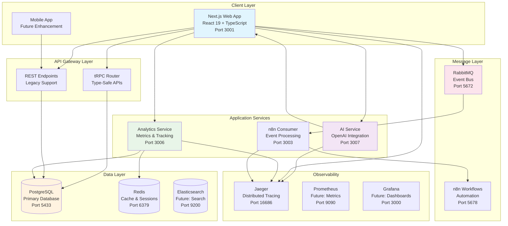
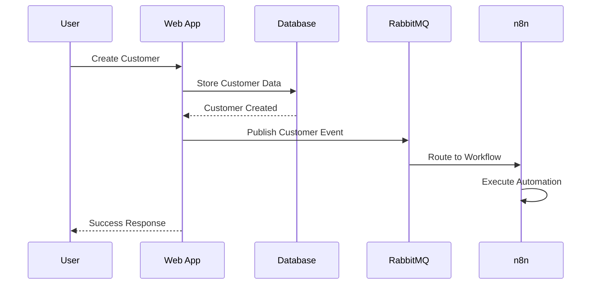
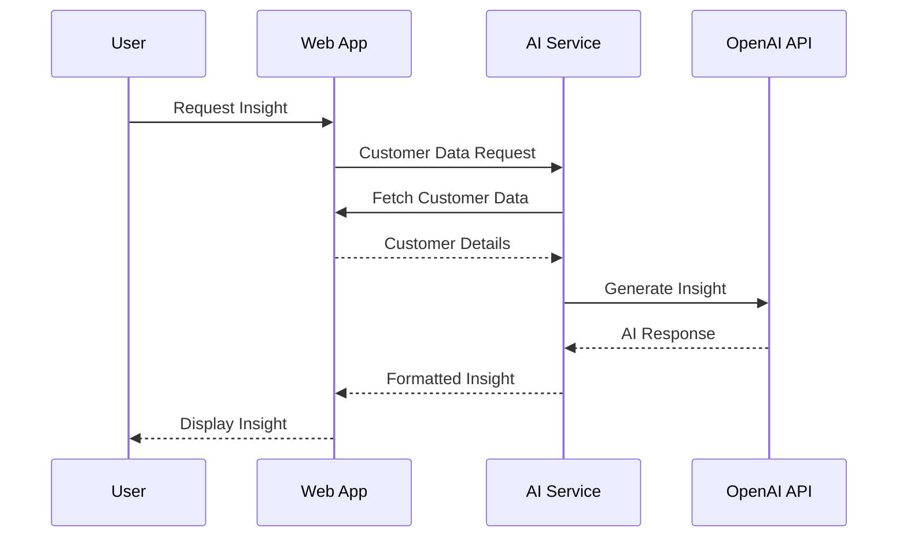
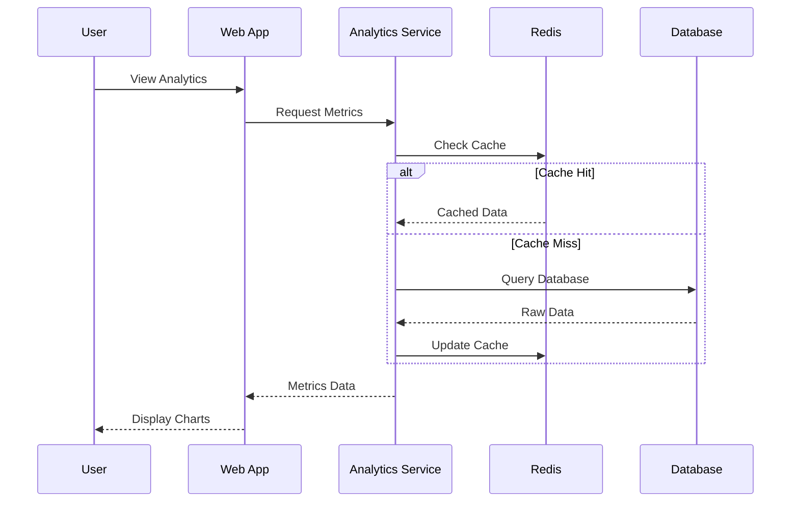

# System Architecture

Lana CRM is built using a modern microservices architecture that emphasizes scalability, maintainability, and observability. This document provides a comprehensive overview of the system design and architectural decisions.

## 🏗️ High-Level Architecture

## 🎯 Architectural Principles

### 1. Microservices Architecture
- **Service Independence**: Each service can be developed, deployed, and scaled independently
- **Technology Diversity**: Services can use different technologies based on their specific needs
- **Fault Isolation**: Failure in one service doesn't cascade to others
- **Team Autonomy**: Different teams can own different services

### 2. Event-Driven Design
- **Loose Coupling**: Services communicate through events rather than direct calls
- **Scalability**: Asynchronous processing handles high loads efficiently
- **Reliability**: Message queues ensure event delivery and processing
- **Extensibility**: New services can easily subscribe to existing events

### 3. API-First Approach
- **Type Safety**: tRPC provides end-to-end type safety
- **Documentation**: APIs are self-documenting through TypeScript
- **Consistency**: Standardized API patterns across all services
- **Developer Experience**: Auto-completion and compile-time validation

### 4. Observability by Design
- **Distributed Tracing**: Track requests across all services
- **Structured Logging**: Consistent log formats for analysis
- **Metrics Collection**: Real-time performance monitoring
- **Health Checks**: Automated service health monitoring

## 🔧 Service Architecture

### Frontend Layer

#### Next.js Web Application
- **Framework**: Next.js 15 with App Router
- **UI Library**: React 19 with concurrent features
- **Styling**: Tailwind CSS for responsive design
- **State Management**: React Query + tRPC for server state
- **Type Safety**: TypeScript with strict mode

**Key Features**:
- Server-side rendering for SEO and performance
- Client-side routing for smooth navigation
- Real-time updates with WebSocket connections
- Progressive Web App capabilities

### API Layer

#### tRPC Router
- **Type Safety**: End-to-end TypeScript types
- **Validation**: Zod schemas for input validation
- **Caching**: React Query integration for client-side caching
- **Batching**: Automatic request batching for performance

**Procedures**:
- Customer management (CRUD operations)
- Project management and tracking
- Analytics data aggregation
- User authentication and authorization

#### REST Endpoints
- **Legacy Support**: Compatibility with existing integrations
- **Webhooks**: External service integrations
- **File Uploads**: Media and document handling
- **Health Checks**: Service monitoring endpoints

### Business Logic Layer

#### AI Service
- **Purpose**: Generate customer insights and recommendations
- **Technology**: Node.js + Express with OpenAI integration
- **Features**:
  - Customer analysis and scoring
  - Predictive analytics
  - Natural language processing
  - Fallback strategies for API failures

#### Analytics Service
- **Purpose**: Real-time metrics and business intelligence
- **Technology**: Node.js + Express with Redis caching
- **Features**:
  - Event ingestion and processing
  - Real-time dashboard data
  - Historical trend analysis
  - Performance metrics collection

#### n8n Consumer
- **Purpose**: Bridge between message queue and workflow automation
- **Technology**: Node.js with RabbitMQ client
- **Features**:
  - Event processing and routing
  - Workflow trigger management
  - Error handling and retry logic
  - Integration with external services

### Data Layer

#### PostgreSQL Database
- **Primary Storage**: Customer, project, and user data
- **ACID Compliance**: Reliable transactions and data integrity
- **Relationships**: Complex data relationships and constraints
- **Performance**: Optimized queries and indexing

**Schema Design**:
- Normalized structure for data integrity
- Proper indexing for query performance
- Foreign key constraints for referential integrity
- Audit trails for data changes

#### Redis Cache
- **Session Storage**: User sessions and authentication
- **Real-time Data**: Analytics counters and metrics
- **Caching**: Frequently accessed data
- **Pub/Sub**: Real-time notifications

### Message Layer

#### RabbitMQ
- **Event Bus**: Reliable message delivery between services
- **Queue Management**: Durable queues with persistence
- **Routing**: Topic-based message routing
- **Dead Letter Queues**: Failed message handling

**Message Patterns**:
- Customer lifecycle events
- Project status changes
- Analytics event streaming
- Workflow triggers

#### n8n Workflows
- **Automation**: Business process automation
- **Integrations**: External service connections
- **Visual Editor**: No-code workflow creation
- **Monitoring**: Execution tracking and logging

## 🔄 Data Flow Patterns

### 1. Customer Creation Flow

### 2. AI Insight Generation

### 3. Real-time Analytics

## 🛡️ Security Architecture

### Authentication & Authorization
- **JWT Tokens**: Stateless authentication
- **Role-Based Access**: Granular permissions
- **Session Management**: Secure session handling
- **API Security**: Rate limiting and validation

### Data Protection
- **Encryption**: Data at rest and in transit
- **Input Validation**: Comprehensive input sanitization
- **SQL Injection Prevention**: Parameterized queries
- **XSS Protection**: Content Security Policy

### Network Security
- **HTTPS Only**: Encrypted communication
- **CORS Configuration**: Controlled cross-origin requests
- **API Rate Limiting**: DDoS protection
- **Service Mesh**: Future: Istio for service-to-service security

## 📈 Scalability Considerations

### Horizontal Scaling
- **Stateless Services**: Easy horizontal scaling
- **Load Balancing**: Distribute traffic across instances
- **Database Sharding**: Future: Partition data for scale
- **CDN Integration**: Static asset distribution

### Performance Optimization
- **Caching Strategy**: Multi-layer caching approach
- **Database Optimization**: Query optimization and indexing
- **Async Processing**: Non-blocking operations
- **Connection Pooling**: Efficient resource utilization

### Monitoring & Alerting
- **Health Checks**: Automated service monitoring
- **Performance Metrics**: Real-time performance tracking
- **Error Tracking**: Comprehensive error monitoring
- **Capacity Planning**: Proactive scaling decisions

## 🔮 Future Enhancements

### Planned Improvements
- **Mobile Application**: React Native mobile app
- **Advanced Analytics**: Machine learning insights
- **Multi-tenancy**: Support for multiple organizations
- **API Gateway**: Centralized API management

### Technology Roadmap
- **Kubernetes**: Container orchestration
- **Service Mesh**: Istio for advanced networking
- **Event Sourcing**: Audit trail and replay capabilities
- **GraphQL**: Alternative API layer

---

This architecture provides a solid foundation for a scalable, maintainable, and observable CRM system while maintaining flexibility for future enhancements.

## 👨‍💻 Architecture Design

**Designed and implemented by**: TJ Guna  
**Website**: [thamizhi.dev](https://thamizhi.dev)  
**Email**: thavaguna.opt@gmail.com

This architecture demonstrates expertise in:
- Microservices design patterns
- Event-driven architecture
- Distributed systems and observability
- Modern web application architecture
- Scalable database design
- Security and performance optimization