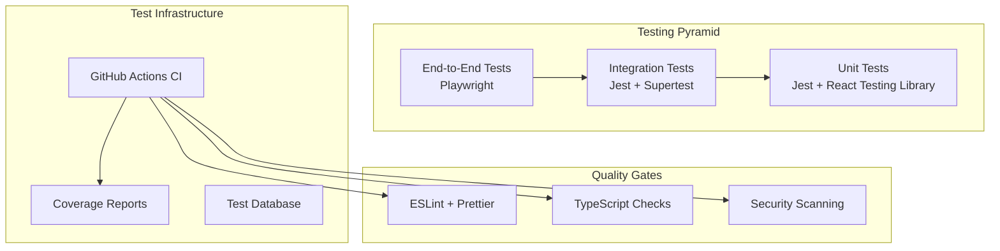
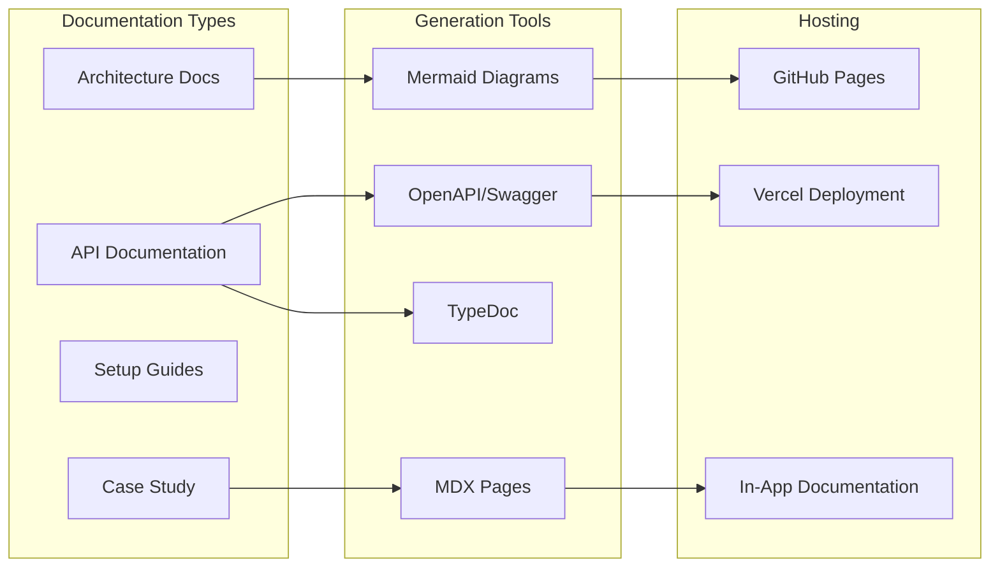
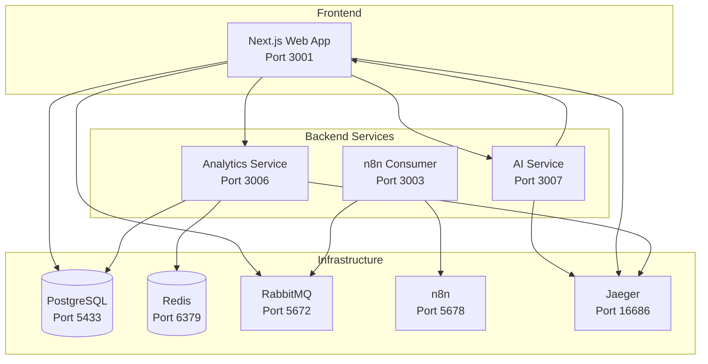

# Testing & Documentation Design Document

## Overview

This design document outlines the comprehensive testing strategy and documentation architecture for the Lana CRM system. The approach focuses on creating a professional, production-ready codebase with excellent test coverage and documentation that showcases technical excellence for portfolio purposes.

## Architecture

### Testing Architecture



### Documentation Architecture



## Components and Interfaces

### Testing Components

#### 1. Unit Testing Framework

- **Technology**: Jest + React Testing Library
- **Scope**: Individual functions, components, utilities
- **Location**: `__tests__` directories alongside source files
- **Coverage Target**: >80% for critical paths

#### 2. Integration Testing Framework

- **Technology**: Jest + Supertest for API testing
- **Scope**: API routes, database interactions, tRPC procedures
- **Location**: `tests/integration/` directory
- **Database**: Isolated test database with seed data

#### 3. End-to-End Testing Framework

- **Technology**: Playwright
- **Scope**: Critical user workflows across services
- **Location**: `tests/e2e/` directory
- **Environment**: Docker-based test environment

#### 4. Performance Testing

- **Technology**: Artillery.js for load testing
- **Scope**: API endpoints, database queries
- **Metrics**: Response time, throughput, error rates

### Documentation Components

#### 1. Architecture Documentation

- **Format**: Markdown with Mermaid diagrams
- **Content**: System overview, service interactions, data flow
- **Location**: `docs/architecture/`

#### 2. API Documentation

- **tRPC**: Auto-generated from TypeScript types
- **REST**: OpenAPI/Swagger specifications
- **Format**: Interactive documentation with examples

#### 3. Setup Documentation

- **Development**: Local setup with Docker
- **Production**: Deployment guides for major platforms
- **Troubleshooting**: Common issues and solutions

#### 4. Case Study

- **Format**: Interactive web page within the application
- **Content**: Technical challenges, solutions, metrics
- **Showcase**: Architecture decisions and implementation highlights

## Data Models

### Test Data Models

```typescript
// Test fixtures and factories
interface TestCustomer {
  id: string;
  name: string;
  email: string;
  value: "LOW" | "MEDIUM" | "HIGH";
  // ... other fields
}

interface TestProject {
  id: string;
  title: string;
  customerId: string;
  status: ProjectStatus;
  // ... other fields
}

// Test database seeding
interface TestSeed {
  customers: TestCustomer[];
  projects: TestProject[];
  users: TestUser[];
}
```

### Documentation Models

```typescript
// API documentation structure
interface APIEndpoint {
  method: string;
  path: string;
  description: string;
  parameters: Parameter[];
  responses: Response[];
  examples: Example[];
}

// Architecture documentation
interface ServiceDiagram {
  services: Service[];
  connections: Connection[];
  dataFlow: DataFlow[];
}
```

## Error Handling

### Test Error Scenarios

1. **Database Connection Failures**

   - Test service behavior when database is unavailable
   - Verify graceful degradation and error messages

2. **API Communication Errors**

   - Test microservice communication failures
   - Verify retry logic and fallback mechanisms

3. **Invalid Input Handling**

   - Test form validation and API input validation
   - Verify error messages are user-friendly

4. **Authentication/Authorization Errors**
   - Test access control and permission handling
   - Verify security boundaries are enforced

### Documentation Error Handling

1. **Broken Links Detection**

   - Automated checking of internal and external links
   - CI pipeline fails on broken documentation links

2. **Code Example Validation**

   - Ensure all code examples in documentation compile
   - Test API examples against actual endpoints

3. **Version Synchronization**
   - Keep documentation in sync with code changes
   - Automated updates for API documentation

## Testing Strategy

### Unit Tests (Foundation Layer)

**Scope**: Individual functions, React components, utility modules

**Key Areas**:

- Analytics calculation functions
- Form validation logic
- Data transformation utilities
- React component rendering and interactions
- tRPC procedure logic

**Tools**:

- Jest for test runner and assertions
- React Testing Library for component testing
- MSW (Mock Service Worker) for API mocking

**Example Structure**:

```
apps/web/__tests__/
├── components/
│   ├── CustomerForm.test.tsx
│   ├── AnalyticsCharts.test.tsx
│   └── AIInsightCard.test.tsx
├── lib/
│   ├── analytics.test.ts
│   ├── rabbitmq.test.ts
│   └── trpc/server.test.ts
└── utils/
    ├── validation.test.ts
    └── formatting.test.ts
```

### Integration Tests (Service Layer)

**Scope**: API routes, database interactions, service communication

**Key Areas**:

- tRPC procedure execution with database
- REST API endpoints with real database
- Microservice HTTP communication
- Event publishing and consumption
- Database transaction handling

**Tools**:

- Jest with Supertest for API testing
- Test database with Docker
- Test containers for isolated environments

**Example Structure**:

```
tests/integration/
├── api/
│   ├── customers.test.ts
│   ├── projects.test.ts
│   └── analytics.test.ts
├── services/
│   ├── ai-service.test.ts
│   ├── analytics-service.test.ts
│   └── rabbitmq.test.ts
└── database/
    ├── migrations.test.ts
    └── queries.test.ts
```

### End-to-End Tests (User Journey Layer)

**Scope**: Complete user workflows across the entire system

**Key Areas**:

- Customer creation and management workflow
- Project creation and Kanban board interactions
- AI insight generation end-to-end
- Analytics dashboard real-time updates
- High-value customer automation pipeline

**Tools**:

- Playwright for browser automation
- Docker Compose for full environment
- Test data seeding and cleanup

**Example Structure**:

```
tests/e2e/
├── customer-management.spec.ts
├── project-workflow.spec.ts
├── ai-insights.spec.ts
├── analytics-dashboard.spec.ts
└── automation-pipeline.spec.ts
```

## Documentation Strategy

### 1. Architecture Documentation

**System Overview Diagram**:



**Service Interaction Patterns**:

- Request/Response patterns between services
- Event-driven communication flows
- Data persistence and caching strategies
- Observability and monitoring setup

### 2. API Documentation

**tRPC Documentation**:

- Auto-generated from TypeScript interfaces
- Interactive playground for testing procedures
- Input/output examples with validation rules

**REST API Documentation**:

- OpenAPI 3.0 specifications
- Swagger UI for interactive testing
- Authentication and error handling examples

### 3. Setup and Deployment Documentation

**Local Development Setup**:

```markdown
# Quick Start Guide

## Prerequisites

- Node.js 18+
- Docker and Docker Compose
- Git

## Installation

1. Clone the repository
2. Install dependencies: `npm install`
3. Start infrastructure: `docker compose up -d`
4. Initialize database: `npm run db:push`
5. Start all services: `npm run dev`

## Verification

- Web App: http://localhost:3001
- Analytics: http://localhost:3006/health
- AI Service: http://localhost:3007/health
- RabbitMQ UI: http://localhost:15672
- Jaeger UI: http://localhost:16686
```

**Production Deployment**:

- Vercel deployment for web app
- Railway/Render deployment for microservices
- Database hosting options (Supabase, PlanetScale)
- Environment variable configuration
- Monitoring and logging setup

### 4. Case Study Documentation

**Interactive Case Study Page** (`/case-study`):

**Technical Highlights**:

- Microservices architecture with proper service boundaries
- Event-driven automation with RabbitMQ and n8n
- Real-time analytics with Redis caching
- AI integration with OpenAI API and fallback strategies
- Distributed tracing with OpenTelemetry and Jaeger
- Type-safe APIs with tRPC and Zod validation

**Challenges and Solutions**:

- Service decoupling and communication patterns
- Real-time data synchronization across services
- Error handling and graceful degradation
- Performance optimization and caching strategies
- Testing complex distributed systems

**Metrics and Achievements**:

- Response time benchmarks
- Test coverage statistics
- Code quality metrics
- Architecture complexity analysis

## Implementation Plan

### Phase 5.1: Unit Testing Setup

- Configure Jest and React Testing Library
- Create test utilities and factories
- Write tests for critical utility functions
- Add tests for React components

### Phase 5.2: Integration Testing

- Set up test database and seeding
- Create API integration tests
- Test microservice communication
- Add tRPC procedure tests

### Phase 5.3: End-to-End Testing

- Configure Playwright test environment
- Create critical user journey tests
- Set up CI/CD pipeline integration
- Add performance benchmarking

### Phase 5.4: Documentation Creation

- Generate architecture diagrams
- Create comprehensive README files
- Set up API documentation
- Build interactive case study page

### Phase 5.5: Quality Assurance

- Code review and refactoring
- Performance optimization
- Security audit and fixes
- Final documentation review

## Success Metrics

- **Test Coverage**: >80% for critical paths
- **Documentation Coverage**: 100% of public APIs documented
- **Performance**: <200ms API response times under normal load
- **Quality**: Zero ESLint errors, consistent formatting
- **Accessibility**: WCAG 2.1 AA compliance for UI components
- **Security**: No high/critical vulnerabilities in dependencies
